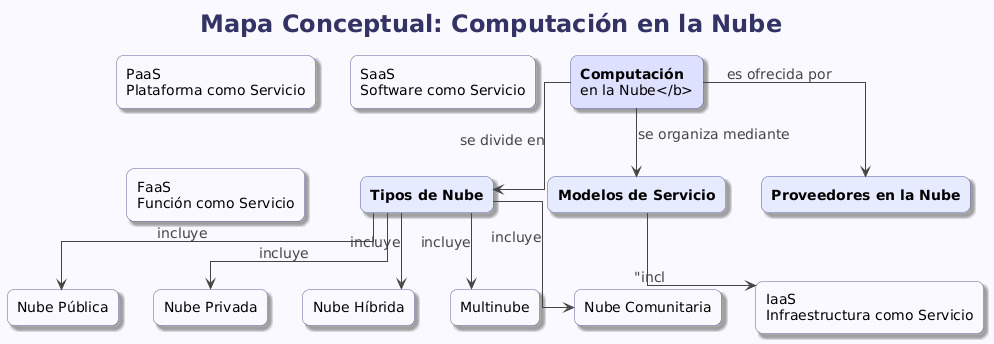

# COMPUTACION-EN-LA-NUBE
La computación en la nube es un modelo que permite acceder a recursos tecnológicos como almacenamiento, servidores, redes y software a través de internet sin necesidad de que el usuario posea la infraestructura físicamente. Esto significa que las empresas y personas pueden usar servicios tecnológicos a demanda, pagando únicamente por lo que consumen y sin encargarse del mantenimiento o la instalación de hardware costoso.

Dentro de la computación en la nube existen varias características fundamentales. La primera es el autoservicio bajo demanda, que permite que los usuarios obtengan recursos como máquinas virtuales o almacenamiento sin intervención humana del proveedor. Otra característica es el acceso amplio a la red, lo que garantiza que los servicios estén disponibles desde cualquier dispositivo conectado a internet. También está la agrupación de recursos, que significa que los proveedores utilizan infraestructura compartida para atender a múltiples clientes. A esto se suman la rápida elasticidad, que permite aumentar o disminuir los recursos según la necesidad, y la medición del servicio, que garantiza control, supervisión y cobro exacto del consumo.

En cuanto a los modelos de servicio, la computación en la nube se divide principalmente en tres categorías. La primera es IaaS, que provee infraestructura como servidores, redes y almacenamiento para que el usuario configure todo lo demás. La segunda es PaaS, una plataforma en la que el usuario desarrolla y despliega aplicaciones sin gestionar el sistema operativo o el hardware. La tercera es SaaS, donde el usuario utiliza directamente aplicaciones listas, como Gmail, Office 365 o Dropbox, sin instalar nada localmente.

Respecto a los modelos de implementación, la nube puede ser pública, cuando los servicios están disponibles para cualquier usuario en internet; privada, cuando la infraestructura se destina exclusivamente a una organización; híbrida, que combina recursos públicos y privados para mejorar flexibilidad y seguridad; o comunitaria, donde varias organizaciones comparten infraestructura con objetivos similares.

Las ventajas de la computación en la nube incluyen un menor costo, ya que no se requiere comprar hardware; mayor escalabilidad, porque los recursos pueden ajustarse fácilmente; disponibilidad casi constante; y facilidades para realizar copias de seguridad. Además, las empresas pueden centrarse en sus actividades principales sin preocuparse por la infraestructura tecnológica. Sin embargo, también existen desventajas. La dependencia del internet es una de ellas, ya que cualquier falla puede impedir el acceso a los servicios. También existen riesgos de seguridad, especialmente en nubes públicas, y la falta de control directo sobre los servidores. En algunos casos, los costos pueden aumentar si no se gestionan adecuadamente los recursos utilizados.

En resumen, la computación en la nube es una herramienta tecnológica esencial en la actualidad que ofrece flexibilidad, eficiencia y accesibilidad. Su adecuada comprensión permite aprovechar sus servicios, entender sus beneficios y ser conscientes de los riesgos que implica su implementación.

